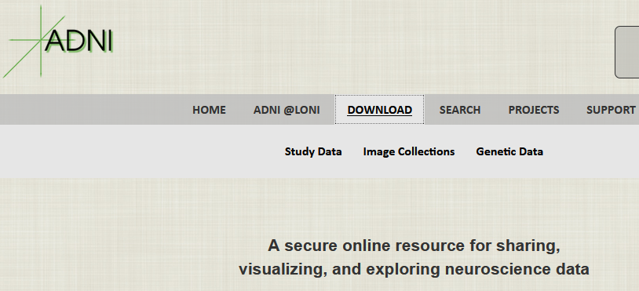
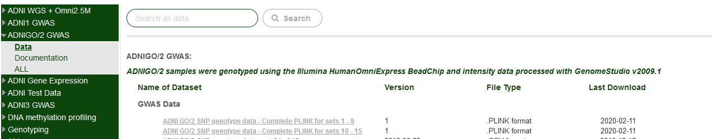
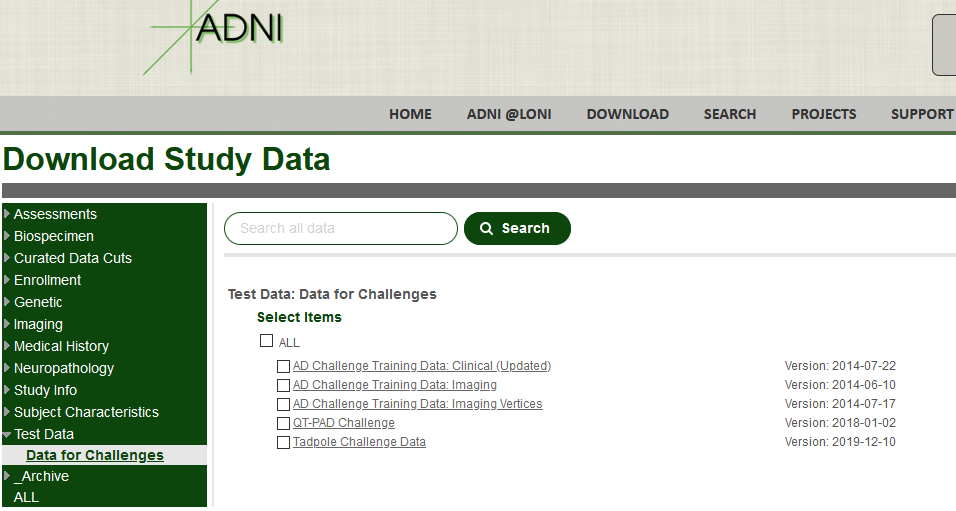

```{r setup, include=FALSE}
knitr::opts_chunk$set(echo = TRUE)
```

# Introduction

This document provides instructions and code to help others reproduce the manuscript. The data come from two sources in the Alzheimer's Disease Neuroimaging Initiative (ADNI)'s database: the TADPOLE challenge and the genome-wide PLINK files for the ADNI-GO/2 cohort.

Below I provide some instructions, screenshots, and links to obtain data and additional software, and I embed code here in this RMarkdown document with explanations of what each chunk does. To note: the code in this RMarkdown file is not run because it references specific folders. Please make sure to make those changes for your own use.


# ADNI

The ADNI project's primary website is here: http://adni.loni.usc.edu/. If you want access to the ADNI data see this link: http://adni.loni.usc.edu/data-samples/access-data/. Once you have been granted access to ADNI (if qualified), you can access data here: https://ida.loni.usc.edu/login.jsp?project=ADNI


Once logged in you will see the following page




## Genetic data

The genetic data are found by clicking "Genetic data" in the above image. You will then go to a page with all of the genetic data available. You need to click ADNIGO/2 and download two archived/compressed PLINK files. The links in the next screenshot refer to those files as "sets 1-9" and "sets 10-15" 





When downloaded, these two files will be named "ADNI_GO_2_OmniExpress.zip" and "ADNI_GO2_2nd.tar.gz" respectively. Next you'll need to extract these files from their archives. You will then see 3 files from each archive: \*.bim, \*.bed, and \*.fam. These are called "PLINK binary files". 

Next you will need to download the PLINK software for processing these data: http://zzz.bwh.harvard.edu/plink/index.shtml


Once you have the PLINK software and the 3 files per archive, you will need to combine the two data sets, then perform some standard quality control on the data, extract specific SNPs, and then export to a new file. This requires only two PLINK commands and one additional external file (provided in this directory: "GETSNPS.txt")


The first PLINK command combines the two data sets:

```{bash, eval = FALSE}

./plink 
    --noweb 
    --bfile "E:\Data\ADNI\Genetics\ADNI_GO_2_Forward_Bin" 
    --bmerge 
      "E:\Data\ADNI\Genetics\ADNI_GO2_GWAS_2nd_orig_BIN.bed"
      "E:\Data\ADNI\Genetics\ADNI_GO2_GWAS_2nd_orig_BIN.bim"
      "E:\Data\ADNI\Genetics\ADNI_GO2_GWAS_2nd_orig_BIN.fam" 
    --make-bed 
    --out "E:\Data\ADNI\Genetics\ADNI2MERGE"

```


The second PLINK command will perform some quality control and extract a smaller data set for you to work with.

```{bash, eval = FALSE}

./plink 
  --noweb 
  --bfile "E:\Data\ADNI\Genetics\ADNI2MERGE" 
  --extract "E:\Data\Publications\PLSCAR\GETSNPS.txt" 
  --maf 0.05 
  --mind 0.1 
  --geno 0.1 
  --recode 
  --tab 
  --out "E:\Data\Publications\PLSCAR\ADNIGo2_CANDIDATE_GENES"
```


Note that the above requires you use the text file GETSNPS.txt available here in this directory. Next, we can use `R` to perform some additional preparation of the data. We start by reading in the smaller genetics set.


```{r eval = FALSE}
## get reduced and preprocessed genetic data
library(data.table)
ped.file <- as.matrix(fread('E:/Data/Publications/PLSCAR/ADNIGo2_CANDIDATE_GENES.ped'))
ped.file <- gsub("[[:space:]]","",ped.file)
ped.ptids <- ped.file[,2]
ped.file <- ped.file[,-c(1:6)]
ped.file <- gsub("00",NA,ped.file)
ped.file <- cbind(ped.ptids,ped.file)
map.file <- as.matrix(fread('E:/Data/Publications/PLSCAR/ADNIGo2_CANDIDATE_GENES.map'))
colnames(ped.file) <- c("PTID",map.file[,2])

## clean up
genetic.data <- ped.file
rm(ped.file)
rm(map.file)

```


The above code reads in two PLINK files: a .ped and a .map. Each contains some important pieces of information for the genetic data. So we read them both in and create `genetic.data` which is are the genotypes for all the SNPs of interest, with the SNP names as column names, and the participant IDs as rownames. We also drop some of the columns used in PLINK format but not required for our own analyses. 


## TADPOLE data


You will also require the TADPOLE challenge data set (for more information on the challenge, see here: https://tadpole.grand-challenge.org/ and here: http://adni.loni.usc.edu/tadpole-challenge-dataset-available/). From the main ADNI data page, click "Study data" and then navigate to the "Test data" tab, and download the TADPOLE data





Once downloaded, extract the .zip file. You will see a number of .csv, .txt, and .py files. We only need two of those going forward. Read in the "D1_D2" dictionary and data files


```{r, eval = FALSE}


TADPOLE_D1_D2_Dict <- read.csv('E:/Data/ADNI/Challenges/TADPOLE/TADPOLE_D1_D2_Dict.csv',header=T,stringsAsFactors = F)

TADPOLE_D1_D2 <- read.csv('E:/Data/ADNI/Challenges/TADPOLE/TADPOLE_D1_D2.csv',header=T,stringsAsFactors = F)

```

The next chunks of code are to extract common participants across the two data sources (genetics, TADPOLE), and to reduce the TADPOLE data set to the measures used in the paper.

# Putting it together

First we need to identify common participants.

```{r, eval = FALSE}
overlapping.ids <- intersect(genetic.data[,1],TADPOLE_D1_D2$PTID)
```

Following that, we want to do some reduction of the data and a bit of clean up.

```{r, eval = FALSE}
ADNIGO.init.locs <- which( TADPOLE_D1_D2$ORIGPROT=="ADNIGO" & TADPOLE_D1_D2$VISCODE=="bl" & (TADPOLE_D1_D2$PTID %in% overlapping.ids)  )
ADNI2.init.locs <- which( TADPOLE_D1_D2$ORIGPROT=="ADNI2" & TADPOLE_D1_D2$VISCODE=="bl" & (TADPOLE_D1_D2$PTID %in% overlapping.ids)  )
TADPOLE_AGO2_BL <- TADPOLE_D1_D2[c(ADNIGO.init.locs,ADNI2.init.locs),]
TADPOLE_AGO2_BL <- TADPOLE_AGO2_BL[-c(which(colSums(is.na(TADPOLE_AGO2_BL))==nrow(TADPOLE_AGO2_BL)))]
TADPOLE_AGO2_BL <- TADPOLE_AGO2_BL[,-c(which((colSums(is.na(TADPOLE_AGO2_BL)) / nrow(TADPOLE_AGO2_BL)) > .1))]

```


Next we focus on just specific measures from the TADPOLE data


```{r, eval = FALSE}

AV45.vars <- TADPOLE_D1_D2_Dict[which(TADPOLE_D1_D2_Dict$TBLNAME=="UCBERKELEYAV45"),"FLDNAME"]
STRUCT.MRI.vars <- c("Ventricles_bl","Hippocampus_bl","WholeBrain_bl","ICV_bl")
KEY.DEMOG.vars <- c("RID","PTID","VISCODE","SITE","COLPROT","ORIGPROT","EXAMDATE","DX_bl","DX","DXCHANGE","AGE","PTGENDER","PTEDUCAT","PTETHCAT","PTRACCAT","APOE4")
CLIN.vars <- c("CDRSB","ADAS11","ADAS13","MMSE","MOCA",paste0(c("CDRSB","ADAS11","ADAS13","MMSE","MOCA"),"_bl"))
BROAD.NIMG.vars <- c("FDG","AV45",paste0(c("FDG","AV45"),"_bl"))
CTX.uptake.vars <- AV45.vars[which(grepl("CTX",AV45.vars) & (!grepl("SIZE",AV45.vars)))]

fin.vars <- c(KEY.DEMOG.vars,CLIN.vars,BROAD.NIMG.vars,CTX.uptake.vars,STRUCT.MRI.vars)


```


Next, we make our final data sets with the appropriate labels (column and row names).


```{r, eval = FALSE}
TADPOLE.fin <- TADPOLE_AGO2_BL[,fin.vars]
rownames(TADPOLE.fin) <- TADPOLE.fin$PTID
rownames(genetic.data) <- genetic.data[,"PTID"]
genetic.data <- genetic.data[rownames(TADPOLE.fin),]
TADPOLE_Dict.fin <- TADPOLE_D1_D2_Dict[which(TADPOLE_D1_D2_Dict$FLDNAME %in% colnames(TADPOLE.fin)),]
```


Finally, save the these matrices in .rda format, which are then opened and used in the RMarkdown for the paper.


```{r, eval = FALSE}
save(TADPOLE.fin,file="E:/Data/Publications/PLSCAR/TADPOLE.fin_2020DEC17.rda")
save(genetic.data,file="E:/Data/Publications/PLSCAR/genetic.data_Data_2020DEC17.rda")
save(TADPOLE_Dict.fin,file="E:/Data/Publications/PLSCAR/TADPOLE_Dict.fin_Data_2020DEC17.rda")
```